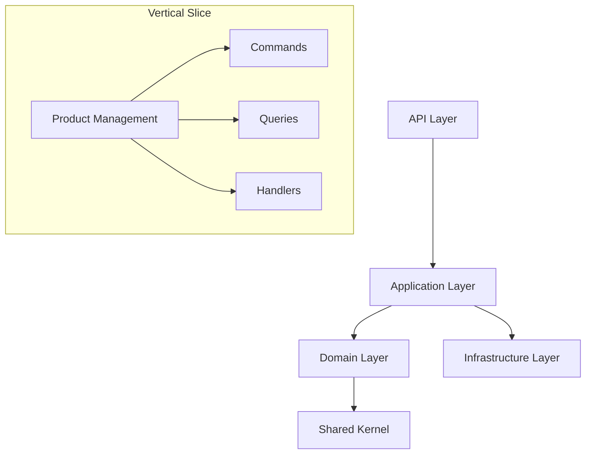

# ERP Inventory Management System


**Enterprise-grade inventory management solution** built with ASP.NET Core 8, implementing Clean Architecture and CQRS patterns. This foundation enables scalable, maintainable inventory operations as part of a comprehensive ERP system.

## Key Features ✨

- **Modern Architecture**: Clean Architecture with vertical slicing
- **Inventory Core**: Product/Warehouse management with real-time tracking
- **Purchasing Workflow**: PO creation, receiving, and three-way matching
- **CQRS Implementation**: MediatR command/query separation
- **Domain-Driven Design**: Rich domain model with business rules enforcement
- **Multi-layer Validation**: FluentValidation + domain invariants
- **Cloud-Ready**: Docker support and CI/CD pipeline configuration
- **Enterprise Foundations**: Audit logging, RBAC, and error handling

## Technology Stack 🛠️

| Layer               | Technologies                                                                 |
|---------------------|------------------------------------------------------------------------------|
| **Presentation**    | ASP.NET Core 8 Web API, Swagger, JWT Authentication                          |
| **Application**     | MediatR, FluentValidation, AutoMapper, CQRS pattern                          |
| **Domain**          | Domain-Driven Design, Entity pattern, Domain Events                          |
| **Infrastructure**  | EF Core 8, SQL Server, Repository Pattern, Caching (Redis)                   |
| **Testing**         | xUnit, Moq, Integration Tests, Testcontainers                                |
| **DevOps**          | Docker, GitHub Actions, Azure Deployment                                     |
| **Monitoring**      | Serilog, Application Insights                                                |

## Solution Structure 📂

```
src/
├── Inventory.API/               # API endpoints and middleware
├── Inventory.Application/        # CQRS handlers and business logic
├── Inventory.Domain/             # Core domain models and rules
├── Inventory.Infrastructure/     # Data persistence and external services
└── Inventory.Shared/             # Cross-cutting concerns and utilities

tests/
├── Inventory.API.IntegrationTests/
├── Inventory.Application.UnitTests/
├── Inventory.Domain.UnitTests/
└── Inventory.Infrastructure.UnitTests/
```

## Getting Started 🚀

### Prerequisites
- .NET 8 SDK
- Docker Desktop
- SQL Server 2022
- VS Code / Visual Studio 2022

### Installation
```bash
# Clone repository
git clone https://github.com/your-org/erp-inventory.git
cd erp-inventory

# Restore dependencies
dotnet restore

# Start database container
docker-compose -f docker/sql.yml up -d

# Apply database migrations
dotnet ef database update --project src/Inventory.Infrastructure
```

### Running the Application
```bash
dotnet run --project src/Inventory.API
```

Access the API at `https://localhost:5001/swagger`

### Running Tests
```bash
dotnet test
```

## Architecture Overview 🏛️



**Core Principles**:
- Domain-centric design
- Dependency Inversion Principle
- Test-Driven Development support
- Clear layer boundaries
- Event-driven extensibility

## Key Components 🔍

### Domain Model
```csharp
public class Product : AuditableEntity
{
    public Guid Id { get; }
    public string SKU { get; private set; }
    
    // Domain invariants
    public void UpdateSKU(string newSku)
    {
        if (string.IsNullOrWhiteSpace(newSku))
            throw new DomainException("SKU cannot be empty");
        SKU = newSku;
    }
}
```

### CQRS Implementation
```csharp
// Command
public sealed record CreateProductCommand(
    string SKU, string Name) : IRequest<Result<Guid>>;

// Handler
public class Handler : IRequestHandler<CreateProductCommand, Result<Guid>>
{
    public async Task<Result<Guid>> Handle(CreateProductCommand command)
    {
        // Business logic execution
        var product = Product.Create(command.SKU, command.Name);
        await _repository.AddAsync(product);
        return product.Id;
    }
}
```

## API Endpoints 🌐

| Endpoint                | Method | Description                     |
|-------------------------|--------|---------------------------------|
| `/api/products`         | POST   | Create new product              |
| `/api/products/{id}`    | GET    | Get product details             |
| `/api/warehouses`       | POST   | Create warehouse                |
| `/api/purchase-orders`  | POST   | Create purchase order           |
| `/api/inventory/adjust` | POST   | Adjust stock levels             |

## Roadmap 🗺️

- [x] Core architecture setup
- [ ] Product management module
- [ ] Warehouse operations implementation
- [ ] Purchasing workflow
- [ ] Reporting and analytics dashboard
- [ ] Mobile inventory scanning support

## Contributing 🤝

We welcome contributions! Please follow these steps:
1. Fork the repository
2. Create your feature branch (`git checkout -b feature/amazing-feature`)
3. Commit your changes (`git commit -m 'Add amazing feature'`)
4. Push to the branch (`git push origin feature/amazing-feature`)
5. Open a pull request

**Commit Message Format**:  
`[Module] Verb: Description`  
Example: `[Product] ADD: Create product endpoint`

## License 📄

This project is licensed under the MIT License - see the [LICENSE](LICENSE) file for details.

---

**ERP Inventory Management System** © 2024 - Enterprise-ready foundation for modern inventory operations.